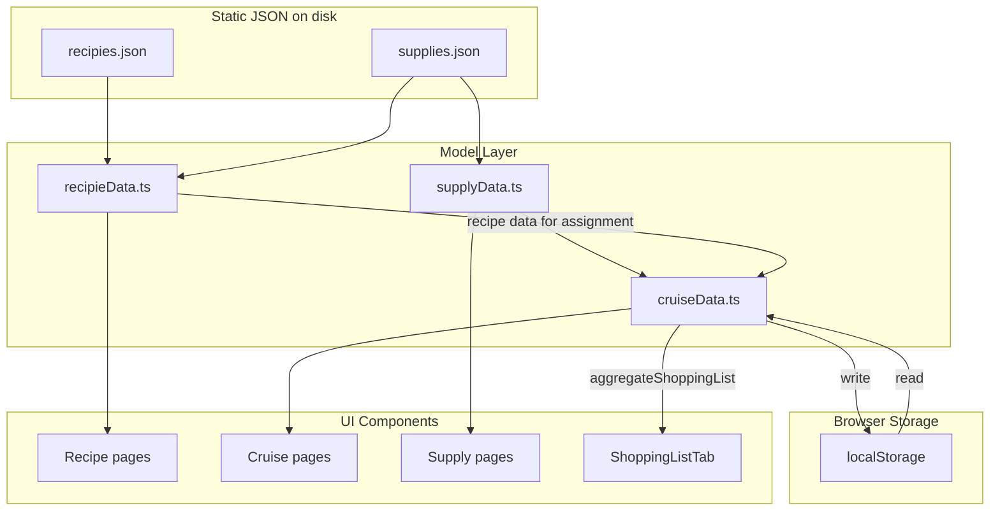

# Contributing to CyberOchmistrz

## Prerequisites

Local machine needs:

- **Node.js** (v20+ recommended, matches CI `actions/setup-node@v4` default)
- **npm** (ships with Node)

No global TypeScript install needed — `tsc` runs via `ts-jest` and `next` from `node_modules`.

## Quick Start

```bash
npm install          # Install dependencies
npm run dev          # Dev server with Turbopack hot reload (localhost:3000)
npm run build        # Production build (static export to out/)
npm start            # Serve production build
npm run lint         # ESLint
npm test             # Jest test suite
```

---

## What the Code Does

**CyberOchmistrz** ("Cyber Steward") is a tool for a ship's second officer (ochmistrz) to prepare provisions for sailing cruises. Core features:

1. **Cookbook** (`/przepisy`) — Browse, add, edit recipes with ingredients, difficulty ratings, meal types
2. **Cruises** (`/rejsy`) — Create cruises (name, days, crew size), assign recipes to each day via drag-and-drop, add extra supplies
3. **Shopping list generation** — Aggregate all ingredients from assigned recipes (scaled by crew count) + additional supplies into a categorized shopping list with CSV export
4. **Supplies catalog** (`/skladniki`) — Browse and add ingredients/supplies used in recipes

Static data (recipes, supplies) ships in JSON. Cruises persisted in `localStorage`. Deployed as static site to GitHub Pages with PWA support.

---

## Directory Structure

```
CyberOchmistrz/
├── .cursorignore              # Excludes build artifacts from Cursor indexing
├── .github/workflows/         # CI (test+build on PR) and CD (deploy to gh-pages on master push)
├── .vscode/                   # Debug launch configs for Next.js
├── public/                    # PWA manifest, static SVGs
├── src/
│   ├── app/                   # Next.js App Router (routes, layouts, pages)
│   │   ├── layout.tsx         # Root layout: nav bar with links to 3 sections
│   │   ├── page.tsx           # Landing page with hero + links
│   │   ├── przepisy/          # /przepisy — recipe list, add, edit
│   │   ├── rejsy/             # /rejsy — cruise list/detail, add, edit
│   │   └── skladniki/         # /skladniki — supplies catalog, add
│   ├── components/            # All React components (see below)
│   │   └── AGENTS.md          # Component conventions for AI agents
│   ├── data/                  # Static JSON catalogs
│   │   ├── recipies.json      # ~20 recipes with ingredients, instructions
│   │   └── supplies.json      # ~100 supplies with units, categories, veg flags
│   ├── model/                 # Domain logic (no UI)
│   │   ├── AGENTS.md          # Model layer rules for AI agents
│   │   ├── cruiseData.ts      # Cruise CRUD, recipe assignment, shopping aggregation, CSV export
│   │   ├── recipieData.ts     # Recipe loading, ingredient resolution, veg checks
│   │   └── supplyData.ts      # Supply loading, filtering, validation
│   ├── types/                 # TypeScript interfaces and enums
│   │   └── index.ts           # Supply, Ingredient, Recipie, Cruise, shopping list types
│   └── utils/
│       └── polishDeclension.ts  # Polish grammatical number for units
├── test/                      # Jest test suite (~15 test files)
│   └── AGENTS.md              # Test conventions for AI agents
├── package.json
├── next.config.ts             # Static export + PWA config
├── jest.config.js
└── tsconfig.json
```

### `src/components/` breakdown

| Component group | Files                                                                      | Purpose                      |
| --------------- | -------------------------------------------------------------------------- | ---------------------------- |
| Cruise workflow | `AddCruiseForm`, `EditCruiseForm`, `CruiseList`, `CruiseDetail`            | CRUD for cruises             |
| Cruise tabs     | `CruiseInfoTab`, `CruiseMenuTab`, `CruiseSuppliesTab`, `ShoppingListTab`   | Tabbed cruise detail view    |
| Drag-and-drop   | `DraggableRecipeItem`, `DroppableDayItem`, `DroppableRecipieContainer`     | Meal planning via dnd-kit    |
| Recipe workflow | `RecipeList`, `RecipeDetail`, `NewRecipeForm`, `StarRating`                | Recipe browsing and creation |
| Editors         | `IngredientListEditor`, `IngredientAmountEditor`, `RecipeIngredientEditor` | Inline ingredient editing    |
| Supplies        | `AddSupplyForm`                                                            | Add new supply to catalog    |

---

## Libraries

### Runtime dependencies

- **Next.js 15.3** — React framework, App Router, static export (`output: 'export'`)
- **React 19** — UI rendering
- **@dnd-kit/core + @dnd-kit/sortable** — Drag-and-drop for assigning/reordering recipes on cruise days
- **next-pwa** — Service worker generation for offline PWA support

### Dev dependencies

- **TypeScript 5** — Type safety
- **Tailwind CSS 4** (via `@tailwindcss/postcss`) — Utility-first styling
- **Jest 30 + ts-jest** — Unit testing
- **jest-theories** — Parameterized test cases
- **ESLint 9 + eslint-config-next** — Linting

---

## Data Flow



Key points:

- Recipes and supplies are **read-only at runtime** — imported from JSON, new ones generate downloadable JSON for manual merge
- Cruises are fully mutable via `localStorage` key `cyber-ochmistrz-cruises`
- Shopping list aggregation happens in `src/model/cruiseData.ts` via `aggregateShoppingList()` — multiplies recipe ingredient amounts by crew count, adds additional supplies with per-person/per-day scaling

---

## State Management

No state library (Redux, Zustand, etc.). Pattern:

- **Static data:** direct `import` of JSON files
- **Mutable data:** `localStorage` with SSR guard (`typeof window === 'undefined'` returns empty)
- **Component state:** React `useState` + `useEffect` for hydration
- Each page that needs cruise data calls `getCruises()` / `getCruiseById()` which reads `localStorage` synchronously
- Mutations call `saveCruise()` which writes back to `localStorage`, then component re-reads

---

## Known Issues and Tech Debt

1. **Drag between days broken** — Cross-day recipe drag-and-drop not working
2. **localStorage only** — No sync between devices, no backend
3. **No online recipe/supply editing** — New items generate JSON for manual file merge
4. **No day add/remove** — Cruise day count fixed at creation (edit can change length but warns about recipe loss)
5. **Typo in codebase** — "recipie" used consistently instead of "recipe" (in filenames, types, variables) — intentional per `.DotSettings` dictionary
6. **Callback type mismatch** — `CruiseSuppliesTab` declares `onSupplyChange(cruise)` but parent passes zero-arg refresh function
7. **DnD ID parsing fragility** — `activeId.split('-')` assumes recipe IDs don't contain hyphens

---

Live at: https://shadowdancer.github.io/CyberOchmistrz/

Static export means no server-side features — everything runs client-side.
